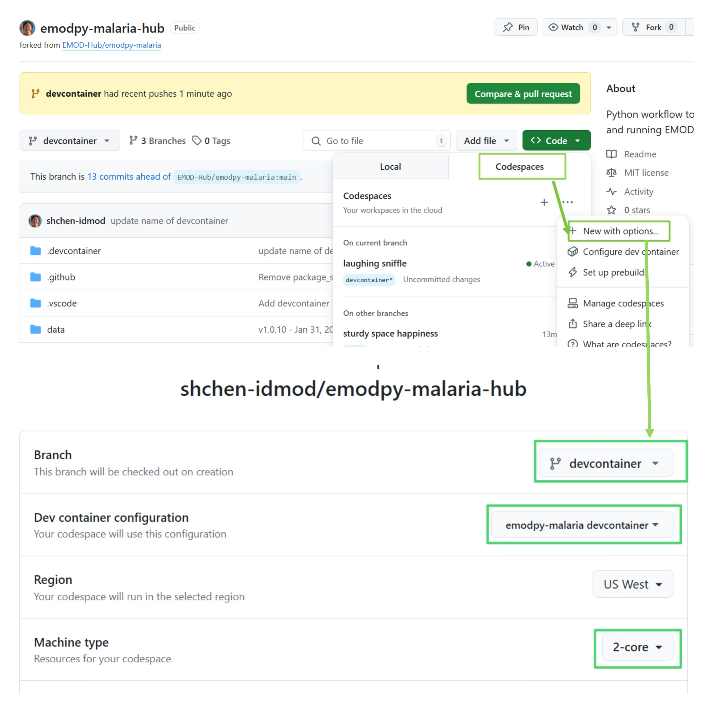
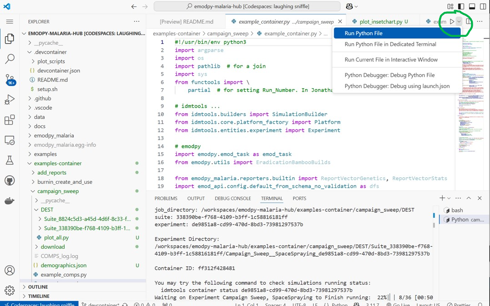
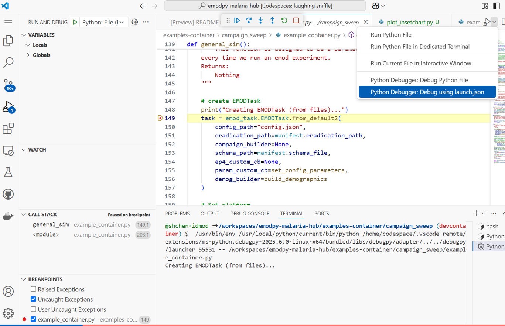
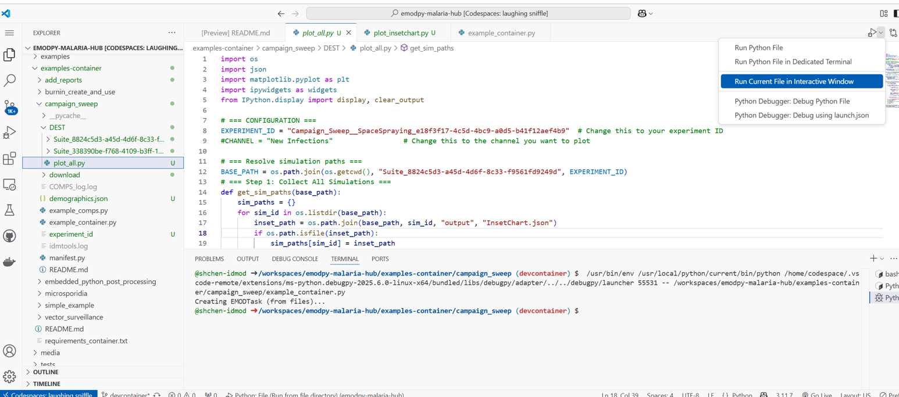
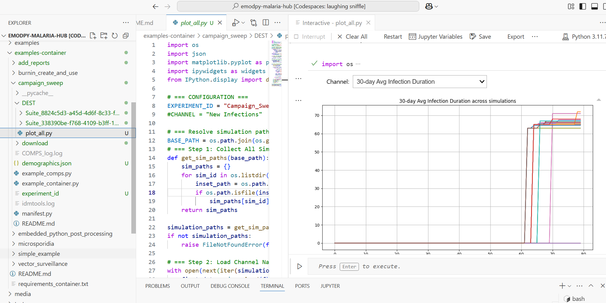

# 🧪 emodpy-malaria Dev Container

This dev container sets up a ready-to-use environment for working on the `emodpy-malaria` project using [VS Code Dev Containers](https://code.visualstudio.com/docs/devcontainers/containers) or [GitHub Codespaces](https://docs.github.com/en/codespaces/overview).

---

## 🐳 What's Inside

This dev container is built on top of the **universal base image**:

- `mcr.microsoft.com/devcontainers/universal:2`

It includes:

### ✨ Features Enabled

| Tool / Language | Version       | Notes                            |
|-----------------|---------------|----------------------------------|
| Python          | 3.11          | With JupyterLab                  |
| Docker-in-Docker| -             | Enables Docker inside container  |
| Pandoc          | Latest        | Document conversion              |
| Quarto CLI      | Latest        | Scientific/technical publishing  |

---

## 💻 VS Code Extensions Installed

| Extension                   | Purpose                       |
|----------------------------|-------------------------------|
| `ms-python.python`         | Python language support       |
| `ms-python.debugpy`        | Python debugging              |
| `ms-toolsai.jupyter`       | Jupyter Notebooks             |
| `ritwickdey.LiveServer`    | Live reload for web dev       |
| `esbenp.prettier-vscode`   | Code formatting               |
| `redhat.vscode-yaml`       | YAML syntax and validation    |

---

## 🛠️ Post-Creation Script

After the container is built, the `setup.sh` script is executed. This script performs the following tasks:
 - Install emodpy-malaria and its dependencies, as well as any additional tools you may need. 
 - Install the latest version of idmtools to override any older versions included with emodpy-malaria.
 - Note, in setup.sh, we install emodpy-malaria from source, you can change this to install from jfrog repository.

---

## 🚀 Getting Started to build dev container in local VS Code

1. Install [Docker](https://www.docker.com/products/docker-desktop)
2. Install [Visual Studio Code](https://code.visualstudio.com/)
3. Install the [Dev Containers extension](https://marketplace.visualstudio.com/items?itemName=ms-vscode-remote.remote-containers)
4. Open the project folder in VS Code
5. Press `F1` and run: `Dev Containers: Rebuild Container`
6. Wait for the container to build and start
7. Open a terminal in VS Code
8. Run your Python scripts or Jupyter notebooks as needed

## 🛠️ Getting Started to build dev container in GitHub Codespaces

1. Open the project in GitHub Codespaces tab
2. Select "+" to create a new codespace on the selected branch
3. Or select an existing codespace to open in browser
4. Wait for the container to build and start
5. Open a terminal in Codespaces
6. Run your Python scripts or Jupyter notebooks as needed

### 🧪 Example Run 


### 🧪 Example debugging


## 📊 Plot InsetChart.json for Container Platform Examples

This guide helps you visualize `InsetChart.json` output from simulations run via the container platform examples.

### 🧪 Steps

1. **Run a container platform example**
   Navigate to the `examples-container/` directory and run the desired simulation:

   ```bash
   cd examples-container/add_reports
   # Run your example here, e.g.
   python example_container.py
   ```
2. **Locate the simulation results**

   After the run completes, go to the directory where the results were saved. This will typically look like:
   ```bash
   cd path/to/job_directory/suite/experiment
   ```
3. **Add the plotting script**

   Copy the `plot_insetchart.py` or `plot_insetchart_dropdown.py` file from the `.devcontainer` directory to your result's experiment directory. 

4. **Edit the script**

   Open the above file in your favorite text editor or IDE. You may need to adjust the paths to the simulation results and the output directory for the plots.

5. **Run the script**

   Execute the script run the script directly in the interactive environment
     - Open plot_insetchart.py

     - Press F1 (or Cmd+Shift+P on macOS)

     - Select "Python: Run Current File in Interactive Window"

    This will generate the inset chart plots in the interactive output pane.

